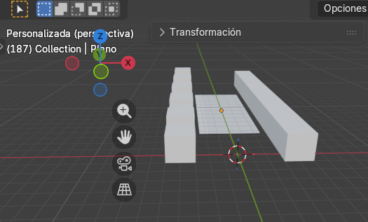
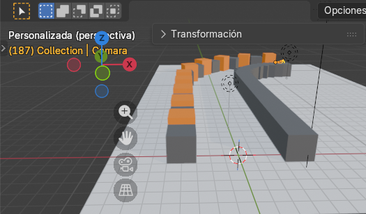

# examen-graficacion-unidad-1
para esta practica debemos de ocupar un codigo para crear un escenario, primero se creara un escenario recto y posteriormente se creara el escenario con una curva como pasillo

## Primer codigo

El primer codigo es para que se cree un escenario. El siguiente escenario que se crea es el siguiente:

## Segundo codigo
- Principales modificaciones
  - ### Implementacion de materiales PBR(Nodos):
  - Se cambio la funcion "crear_material" dejo de usar el antiguo "diffuse_color". Ahora activa el uso de nodos "(mat.use_nodes = True)" y localiza el nodo Principled BSDF.
    Permite crear materiales fotorrealistas. Además de asignar el color base, ahora se configura la propiedad Roughness (rugosidad) en 0.7, lo que le da un aspecto menos plástico y más realista a las paredes al interactuar con la luz.
  - ### Adición de un Tramo Curvo (Geometría Avanzada):
  - Lo que cambio es que se importó la librería math y se agregó la sección # 4b. Tramo Curvo. Se definió un nuevo parámetro radio_curva = 12.
    Lo que realiza esto es que utiliza trigonometría (senos y cosenos) para calcular las coordenadas exactas y la rotación necesaria para colocar los cubos formando una curva perfecta al final del pasillo recto original. El suelo también se redimensionó dinámicamente para cubrir esta nueva área.
  - ### Cámara y Animación por Keyframes:
  - Se añadieron las secciones # 7 y # 8, que introducen una cámara y un ciclo for que registra fotogramas clave (keyframe_insert).
    Lo que hace esto es que sitúa una cámara a la altura de los ojos humanos ($Z=1.5$). Luego, automatiza una animación de 250 fotogramas (unos 10 segundos). Configura la cámara para que avance en línea recta los primeros 100 fotogramas y, del 101 al 250, calcula matemáticamente su posición y rotación cuadro por cuadro para que gire de manera suave acompañando la nueva curva del pasillo.

    ### Resultados del segundo codigo

    
    
